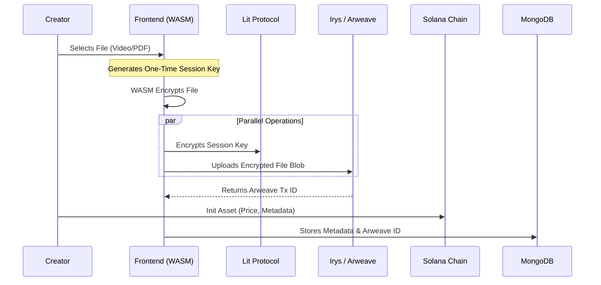
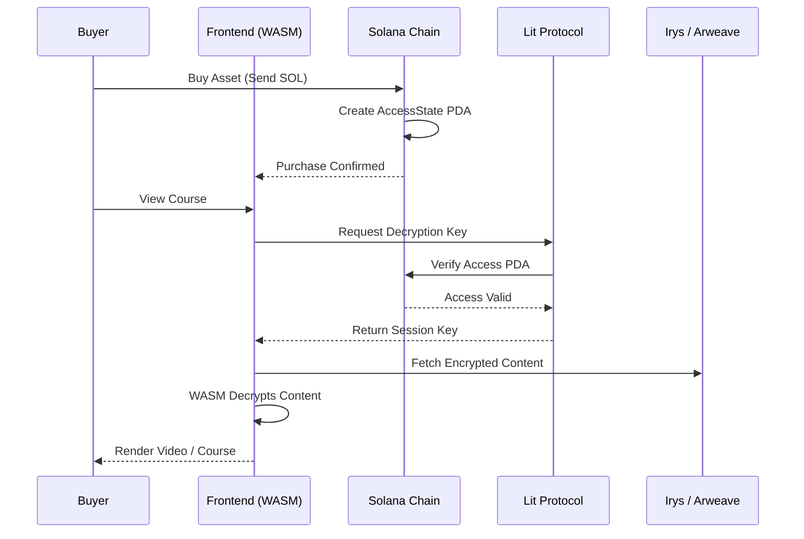

# 🎓 DeED – Decentralized Educational Digital Marketplace

**DeED** is a fully decentralized platform for creators to upload, encrypt, and sell educational content (courses, videos, documents). It leverages a **multi-chain architecture** to ensure content is permanently stored, securely encrypted, and transparently traded without centralized intermediaries.

---

## 🏗 System Architecture & Workflow

DeED integrates four decentralized technologies to create a secure:
**Upload → Encrypt → Sell → Decrypt** pipeline.

---

## 1️⃣ Storage Layer: Irys (Arweave)

- **Role:** Permanent, censorship-resistant storage  
- **Workflow:**
  - Large files (videos / PDFs) are encrypted directly in the browser
  - The **encrypted blob** is uploaded to Arweave via Irys
  - Users pay once, and the content persists forever on the **Permaweb**
- **Library:** `@irys/sdk`

---

## 2️⃣ Encryption Layer: Lit Protocol

- **Role:** Decentralized key management & access control  
- **Workflow:**
  - A random symmetric key is generated per course
  - The key is encrypted by Lit Network nodes
  - The key is released **only** if access conditions are met
- **Access Condition:** Ownership of the **Solana Asset PDA**
- **Library:** `@lit-protocol/lit-node-client`

---

## 3️⃣ Execution Layer: Rust WASM Enclave

- **Role:** Secure client-side cryptographic execution  
- **Workflow:**
  - **Encryption:** File chunks are encrypted via WASM during upload
  - **Decryption:** Encrypted data + session key are passed to WASM for playback
- **Benefits:**
  - Near-native performance in the browser
  - Private keys never touch the main JS thread
- **Tech:** Rust → WebAssembly (`wasm-pack`)

---

## 4️⃣ Settlement & Ownership: Solana Blockchain

- **Role:** Payments and proof of ownership  
- **Workflow:**
  - **Creators:** Initialize an `Asset` PDA for each course
  - **Buyers:** Send SOL via the `buy_asset` instruction
  - **Access:** Smart contract creates an `AccessState` PDA as an on-chain receipt
- **Framework:** Anchor (Rust)

---

## 🔁 Upload Flow (Creator)

---

## 🔐 Purchase & Access Flow (Buyer)

---

## 🛠 Tech Stack

### Frontend
- React.js (Vite)
- Bootstrap / Custom CSS
- Solana Wallet Adapter (Phantom, Solflare)

### Backend (Middleware)
- Node.js / Express
- MongoDB (stores metadata & PDA references)
- Indexes on-chain events for fast queries

### Smart Contract
- **Network:** Solana Devnet
- **Framework:** Anchor (Rust)
- **Instructions:**
  - `init_asset` – register a new course
  - `buy_asset` – handle payments & access control

---

## 🔐 Security Model

- **Client-Side Encryption:** Content is never uploaded unencrypted
- **Session Binding:** Keys are tied to wallet signatures to prevent replay attacks
- **On-Chain Verification:** Access depends solely on Solana PDA existence

---

## 📄 License

This project is licensed under the MIT License.  
See the LICENSE file for details.
